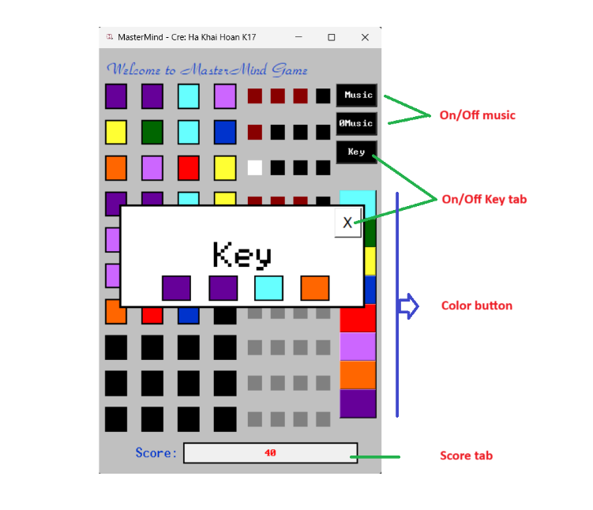

## **MASTERMIND GAME**

### *Creator: Ha Khai Hoan*
### **Opened: Wednesday, 5 October 2022, 12:00 AM**

## **Overview**

* Mastermind or Master Mind is a code-breaking game for two players. The modern game with pegs was invented in 1970 by Mordecai Meirowitz, an Israeli postmaster and telecommunications expert.It resembles an earlier pencil and paper game called Bulls and Cows that may date back a century or more..

* In the popular game Mastermind, one player creates a secret code of four pegs, each of which can be chosen from one of six colors. (The number of pegs and colors may be different than this in different versions, but your implementation will use these values, but be extendible, very easily, to other values. Also, a color can be reused, thus there really are six choices for each of the four pegs.) The other player then has to guess the color of each peg, with the order mattering.
 
* The player who made the secret code then has to give feed back to the player guessing. This feedback is in the form of white and black pegs. A black peg means that the guesser has chosen the correct color in the correct slot. These are first “calculated” and awarded. Once these are counted, these pegs are ignored. Then the white pegs are awarded. These are for pegs that are the correct color but are in the incorrect slot. There is no “double dipping” of pegs in the response, so the sum total of white and black pegs the guesser can receive is four, and no one peg in the guesser’s answer may earn them more than one black or one white peg.

## **Technology**
<ul>
<li>Python</li>
<li>Tkinter library</li>
</ul>

## **FUNCTIONS**

**Thank you**

